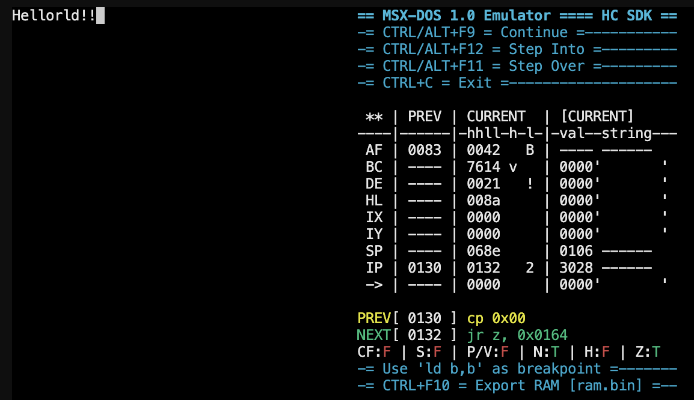

# HC Software Development Kit for Retro Computing

**Version 2.0** — Cross-compilation toolchain for 8-bit and 16-bit retro computer platforms.




## Quick Links

| Document | Description |
|----------|-------------|
| [Quick Start Guide](docs/quickstart.md) | Get started in 5 minutes |
| [HC Assembler](docs/assembler.md) | hcasm — multi-target assembler |
| [HC B Compiler](docs/bcompiler.md) | hcbcomp — B language compiler with full reference |
| [HC Linker](docs/linker.md) | hclink — linker with bin/rex output |
| [HC Librarian](docs/librarian.md) | hclib — object/library manager |
| [HC Builder](docs/builder.md) | hcbuild — project build system |
| [MSX-DOS Emulator](docs/emulator.md) | msxdosemu — CP/M 2.2 emulator |
| [REX Format](docs/format-rex.md) | Relocatable executable format |

## Supported Target CPUs

| CPU | Assembler | B Compiler | Runtime Lib |
|-----|-----------|------------|-------------|
| Zilog Z80 | `hcasm-z80` | `hcbcomp-z80` | CP/M, MSX-DOS |
| Intel 8080 | `hcasm-8080` | `hcbcomp-8080` | CP/M |
| Intel 8085 | `hcasm-8085` | `hcbcomp-8085` | CP/M |
| Intel 8086 | `hcasm-8086` | `hcbcomp-8086` | MS-DOS |

## Supported Host Platforms

| Platform | Format |
|----------|--------|
| macOS (Intel/ARM) | `.pkg` installer, `.tgz` |
| Windows 64-bit | `.exe` NSIS, `.zip` |
| Windows 32-bit | `.exe` NSIS, `.zip` |
| Linux x86\_64 | `.deb` package, `.tgz` |
| DOS (Pentium+) | `.zip` (DJGPP) |
| Linux ARM, FreeBSD, OpenBSD | Build from source with `make` |

## Build from Source

```sh
make posix         # Native build (macOS/Linux/BSD)
sudo make install  # Install to /usr/local/bin
```

## Install

```sh
make all
sudo make install
```

## Project Structure

| Directory | Contents |
|-----------|----------|
| `hcasm/` | Multi-target assembler source |
| `hclink/` | Linker source |
| `hclib/` | Librarian source |
| `hcbuild/` | Project builder source |
| `hcbcomp/` | B language compiler source |
| `msxdosemu/` | MSX-DOS / CP/M emulator source |
| `libs/` | Runtime libraries (assembly + B) |
| `libs/b/` | B language standard library |
| `samples/` | Example projects |
| `tests/` | Test suite |
| `include/` | Shared headers |
| `bin/` | Build output |

## Links

- [Site e Documentação em Português](https://humbertocsjr.dev.br/hcsdk/pt)
- [Documentation in English](https://humbertocsjr.dev.br/hcsdk/en)
- [Hackaday Article](https://hackaday.com/2026/03/17/from-8086-to-z80-building-a-nasm-inspired-sdk-for-8-bit-retro-computing/)
- [retroSOX — Brazilian OS for MSX](https://humbertocsjr.dev.br/retrosox)
