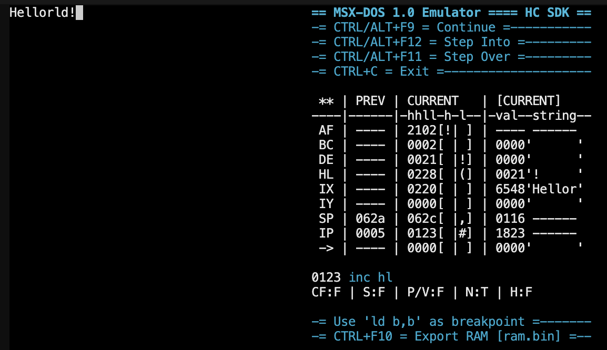

# HC Software Development Kit for Retro Computing

Cross-compiler tools for retro computing.



Tools ready to use:
- Assembler
- Linker
- Librarian
- Project Builder

Tools in development:
- RetroLang (Simple programming language for 8 bit)
- MSX-DOS 1.0 / CP/M 2.2 Emulator

[Site e Documentação em Português](https://humbertocsjr.dev.br/hcsdk/pt)

[Site and Documentation in English](https://humbertocsjr.dev.br/hcsdk/en)

[RetroLang (In Alpha) Documentation](retrolang.md)


## TODO List (2.0 Roadmap | Early April/26)

- MSX-DOS 1.0 (CP/M 2.2 Compatible) Emulator (In progress)
    - Support for Fxx keys / ALT+Fxx keys / CTRL+Fxx keys alternatives (**Done**)
        - ALT+Fxx keys -> tested on macOS Terminal
        - CTRL+Fxx keys -> tested on VSCode Terminal
        - F9-F12 keys -> tested on Linux Fullscreen Terminal
    - Dump memory to file (**Done**)
    - Embbed Breakpoint on Binary 'ld b,b' [Inspired on 'xchg bx, bx' from Bochs] (**Done**)
    - Windows Console Compatibility (Planned 2.1)
    - POSIX (macOS/Linux/BSD/Windows WSL) Console Compatibility (**Done**)
    - Z80 Emulation (**Done**)
    - Screen/Keyboard I/O to VT110 TTY Mode (In progress)
    - Screen 40x24 with Debug Mode (In progress)
    - Screen 80x24 with Debug Mode (Planned for 3.0)
    - MegaRAM / Slot Support (Planned for 2.9)
    - Mapper / MSX-DOS 2.0 Extensions (Planned for 3.0)
    - CALL 5 ABI (In progress)
        - File ABI (In progress)
            - Open FCB (**Done** / Testing)
            - Close FCB (**Done**)
            - Read Sequencial FCB (**Done** / Testing)
            - Write Sequencial FCB (Planned)
            - Read Random FCB (Planned)
            - Write Random FCB (Planned)
        - Console ABI (**Done**)
    - MSX-BIOS ABI (Planned)
        - Screen ABI (Planned)
    - MSX Hardware Emulation (Planned)
        - Screen 40x24 Direct Manipulation (Planned)
        - Screen 80x24 Direct Manipulation (Planned for 3.0)
        - Joystick input (Planned for 3.0)
- RetroLang Compiler (In progress)
    - Implement all planned pointers (In progress)
    - Structure Support (Planned)
    - Array Support (Planned)
    - 8086 Target and Libraries
        - 8086 Target (**Done**)
        - DOS Library (Planned)
        - BIOS-only Library (Planned) 
    - Z80 Target and Libraries
        - Z80 Target (In progress / Testing)
        - Common Math/Logic Runtime Library (**Done** / Testing)
        - CP/M 2.2 Library (In progress)
        - MSX-DOS 1.0 Library (Planned)
    - 8080 Target and Libraries (Planned for 3.0)
- HC Builder
    - Embbed SDK BIN/Libraries/Include Path on install (Planned for 2.1)
- HC Assembler
    - 6502 Target Support (Planned for 3.0)
- Integration on VSCode (Planned for 3.0)

## Supported Targets

- **8080**:  Intel 8080 or Compatibles
- **8085**:  Intel 8085 or Compatibles
- **8086**:  Intel 8086/8088 or Compatibles (Single segment executable output)
- **Z80**: Zilog Z80 or Compatibles

## Supported Hosts - Pre-compiled distribution

- **macOS - Intel/Apple Silicon**:
    - hcsdk-macos-v??.??.??-setup.pkg: macOS Installer
    - hcsdk-macos-v??.??.??.tgz: macOS Binaries
- **Windows - Intel 64 bits**:
    - hcsdk-win-v??.??.??.zip: Windows Binaries
    - hcsdk-win-v??.??.??-setup.exe: Windows Installer
- **Windows - Intel 32 bits**:
    - hcsdk-win32-v??.??.??.zip: Windows Binaries
    - hcsdk-win32-v??.??.??-setup.exe: Windows Installer
- **Linux - Intel**
    - hcsdk-linux-v??.??.??.tgz: Linux Binaries
    - hcsdk-linux-v??.??.??.deb: Debian/Ubuntu-based Package

## Tested Hosts - Build with make

- **Linux - ARM**
- **FreeBSD - Intel**
- **OpenBSD - Intel**

## Install

Installing on /usr/local/bin:

```sh
make all
sudo make install
```

## How to use (8086 example)

- Create a example file (example.s):
    ```asm
    section text
    global _start
    _start:
        int 0x20
    ```
- Assemble to object file
    ```sh
    hcasm-8086 -o example.obj example.s
    ```
- Link to .com file
    ```sh
    hclink-bin -text 0x100 -o example.com example.obj
    ```

## Development on macOS

Installing the minimum requirements for development:

```sh
brew tap messense/macos-cross-toolchains
brew install dpkg llvm cmake xwin mingw-w64 x86_64-unknown-linux-gnu msitools nsis
```

**Generating distribution files:**

```sh
make distro
```

# RetroLang for Retro Computing

Low Level Programming Language inspired in Ruby, BASIC, T3X and Pascal.

**Don't use. Pre-alpha Compiler**


# HC Assembler for Retro Computing

Inspired in NASM Source Code Format.


## Intel 8080 / 8085 Support

- Support BC/DE/[BC]/[DE] or B/D/[B]/[D] on 16 bit operations
    ```asm
    ; all four generate the same opcode
    stax bc ; modern format
    stax b ; old school format
    stax [bc] ; nasm-like format
    stax [b] ; old school nasm-like format
    ```
- Support M/[HL]/[M] on pointer operations
    ```asm
    ; all tree generate the same opcode
    mov a, m
    mov a, [m]
    mov a, [hl]
    ```

## Zilog Z80 Support

- Use [] as address markers \
    ```asm
    ld a, [0x1234]
    ld a, [bc]
    ```

## Intel 8086/8088 Support

- Alow command prefixes and some argument prefixes:
    ```asm
    ; command prefixes
    cs mov ax, [label]
    rep movsb
    ; argument prefixes
    mov word [0x123], 123
    mov [0x123], word 123
    call near label
    call far label
    je short label
    je near label
    je far label
    ; NOT SUPPORTED PREFIXES:
    mov ax, [cs:label] ; DO NOT USE
    ```
- Allow jCC near and far (8086/8086 full compatible)
    ```asm
    je label_with_offset_less_than_128_bytes
    je near label_with_offset_greater_than_128_bytes
    je far segment:offset
    je far label_in_other_segment ; (not supported in all link output formats)
    ```
- Allow LOOP/LOOPZ/LOOPE/LOOPNZ/LOOPNE/JCXE/JCXZ/JECXZ/JECXE near and far (8086/8086 full compatible)
    ```asm
    loop label_with_offset_less_than_128_bytes
    loop near label_with_offset_greater_than_128_bytes
    loop far segment:offset
    loop far label_in_other_segment ; (not supported in all link output formats)
    ```

## Source Code Format

```asm
label: mnemonic arg1, arg2 ; comment
```

### Labels

```asm
global _start   ; export _start label
_start:
.sublabel:
main:
.sublabel:
    mov ax, [.sublabel]
    mov ax, [main.sublabel]
    mov ax, [_start.sublabel]
```

### Constants

```asm
const_123: equ 123
const_456 equ 456
const_math equ 1+2*3
struct_test: equ 2 ; size
    .field1: equ 0 ; offset
    .field2: equ 1 ; offset

section data
    obj_test: resb struct_test

section text

    mov ax, const_math ; simple example
    mov al, [obj_test + struct_test.field1]
    mov si, obj_test
    mov bl, [si+struct_test.field1]
```

### Sections

Common section order:

- text section
- data section
- bss section

Input code:

```asm

section data
    db 0x56
section text
    db 0x12
section bss
    db 0x9a ; Invalid command for bss, used only as an example.
section data
    db 0x78
section text
    db 0x34

```

Binary output (Hexadecimal view):

```
TEXT     | DATA    | BSS
0x12 0x34 0x56 0x78 0x9a
```

### Data/Address Reference/Address Access

```asm
section data
    var: dw 0x1234
    structure:
        .field1: db 0x12
        .field2: db 0x34
section text
    ; data
    mov ax, 0x1234 ; hexadecimal
    mov bx, 1234 ; decimal
    mov cx, 0b10010001 ; binary
    mov dx, 0o777 ; octal
    mov si, 0777 ; octal
    ; address reference
    mov si, var
    mov di, structure.field1
    ; addres access
    mov al, [structure.field1]
    mov [structure.field2], bl
```

# HC Librarian for Retro Computing

Add/Replace objects into library

```sh
hclib test.lib test1.obj test2.obj test3.obj
```

# HC Linker for Retro Computing

## Output formats

- **bin**: Flat Binary
- **rex**: Relocatable Executable

## HC Linker for Flat Binary

**Supported arguments:**

- -text [OFFSET] \
    Define start of text section
- -data [OFFSET] \
    Define start of data section
- -bss [OFFSET] \
    Define start of bss section
- -align [OFFSET] \
    Define align of all sections

```sh
# Generate CP/M .COM file
hclink-bin -o test.com -text 0x100 test.obj lib.lib
# Generate Generic .BIN file
hclink-bin -o test.bin test.obj lib.lib
# Generate MSX Simple .ROM file
hclink-bin -o test.rom -text 0x4000 -bss 0xc000 test.obj lib.lib
```

## HC Linker for Relocatable Executable

**Supported arguments**

- -align [OFFSET] \
    Define align of all sections

```sh
hclink-rex -o test.rex test.obj lib.lib
```

## HC Builder

Configuration example (.prj file):

```ini
[config] ; optional section
dump = yes ; optional (default: no) - dump object dump from assembly
verbose = yes ; optional (default: no)
sdk_path = ./ ; optional (default: empty string) - hcsdk tools path

[files:z80] ; use files:ARCH
main.s ; file list

[libs] ; optional section (allow objects or library)
runtime.lib
single.obj

[libs:start] ; optional section (set start object from external runtime)
start.obj

[link:release] ; use link:CONFIGURATION
format = com ; hclink output format: (use lib to generate library using hclib)
filename = example.com ; optional (default: a.out)
text = 0x100 ; optional hclink arguments (eg: text, data, bss, align)

[link:debug]
format = com
filename = example.com
text = 0x100
symbols = example.sym ; optinal symbols output file name (default: ignore file generation)
```

### How to make project

```sh
# make release configuration
hcbuild project.prj make release # build project in current direcorty
hcbuild projectdirectory/project.prj make release # build project on another directory
```

### How to clean project

```sh
# make release configuration
hcbuild project.prj clean release
```

# Relocatable Executable Format

## File Layout (Order)

- Header
- text section
- data section
- bss section
- relocation table

## Header

| Offset | Size | Description                                   |
|--------|------|-----------------------------------------------|
| 000000 | 0002 | 'HC' String                                   |   
| 000002 | 0002 | text size                                     |
| 000004 | 0002 | data size                                     |
| 000006 | 0002 | bss size                                      |
| 000008 | 0002 | _start offset (use text position as base)     |
| 000010 | 0002 | reloc size (each item has 2 byte offset)      |
| 000012 | 0003 | reserved                                      |
| 000012 | 0001 | cpu id                                        |

CPU IDs:

- 0xF0: Intel 8080
- 0xF1: Intel 8085
- 0xF2: Zilog Z80
- 0xF3: Intel 8086
- 0xF4: Intel 8052

## How to load

- Read first 16 bytes (header)
- Alloc (text size + data size + bss size) on continuous space on memory
- Copy text and data segments to memory
- Process relocation table
    - Read relocation item (offset (2 bytes address))
    - Select word (2 bytes) at offset on application memory
    - Add offset of start of text section to selected word value
